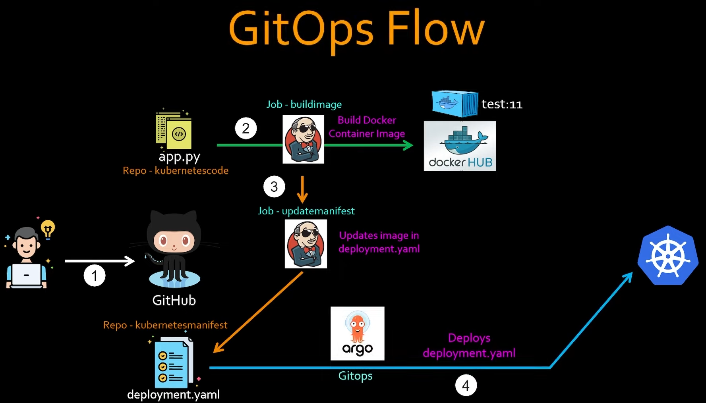

🔰 A scalable and production-ready full-stack web application, combining the power of React, Django, and PostgreSQL. Seamlessly deployed and orchestrated with Kubernetes, while leveraging CI/CD using Jenkins and ArgoCD for streamlined development and reliability.
 
## CI/CD Workflow

## Running locally

  
  

   
Trying to test with different tech stacks, therefore....

