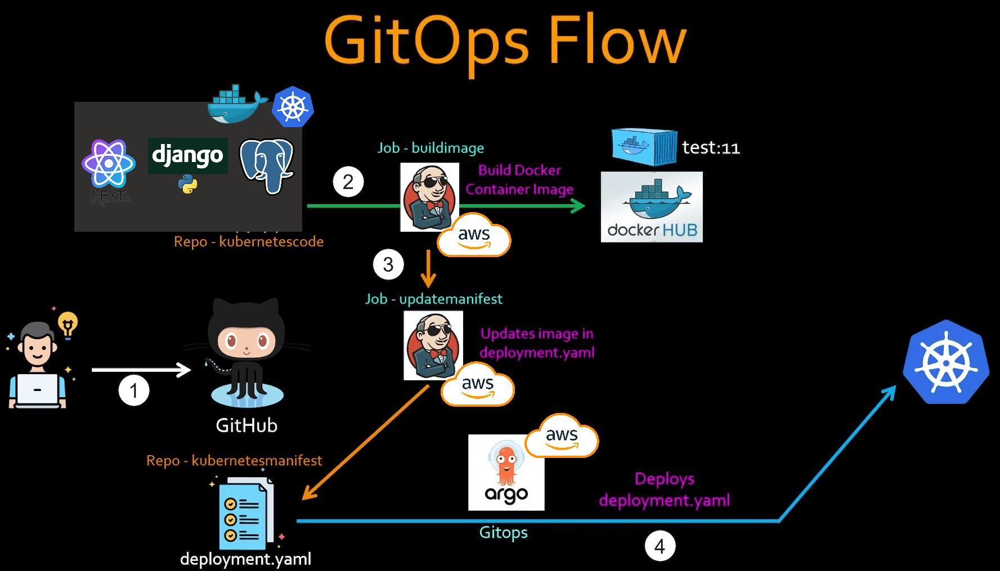
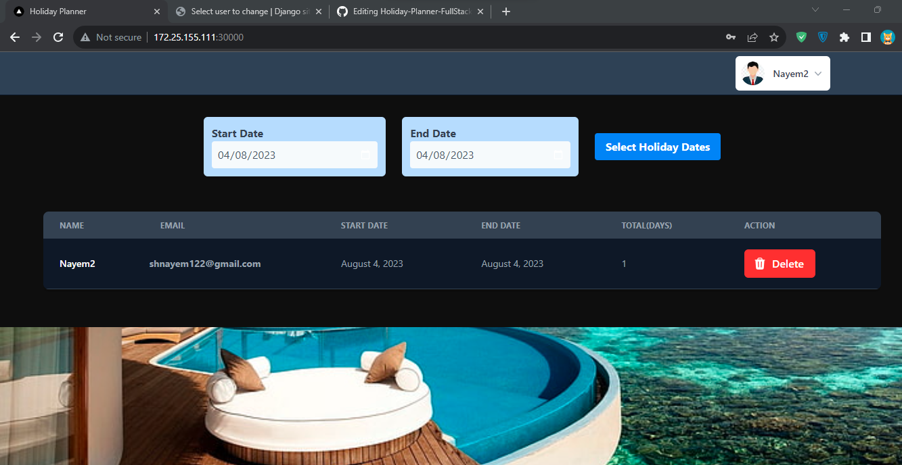
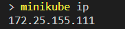
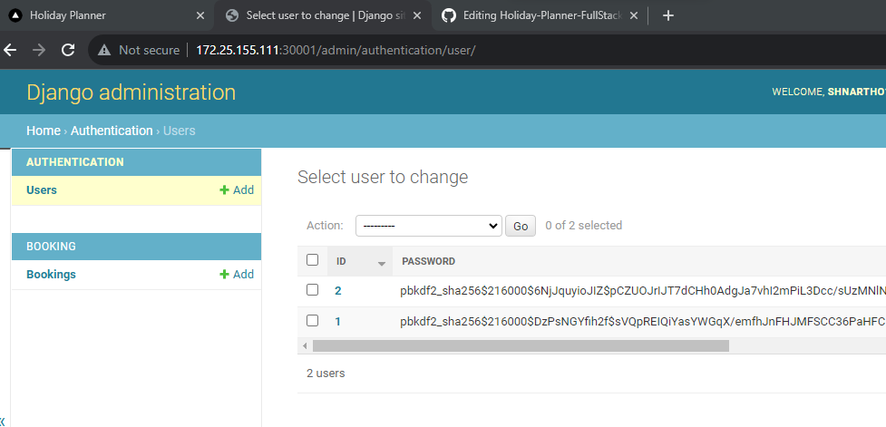
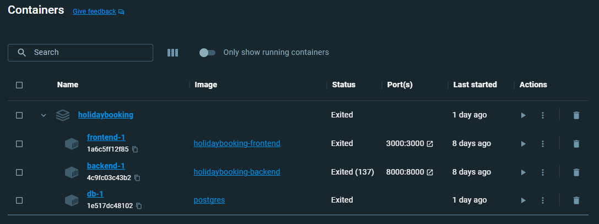
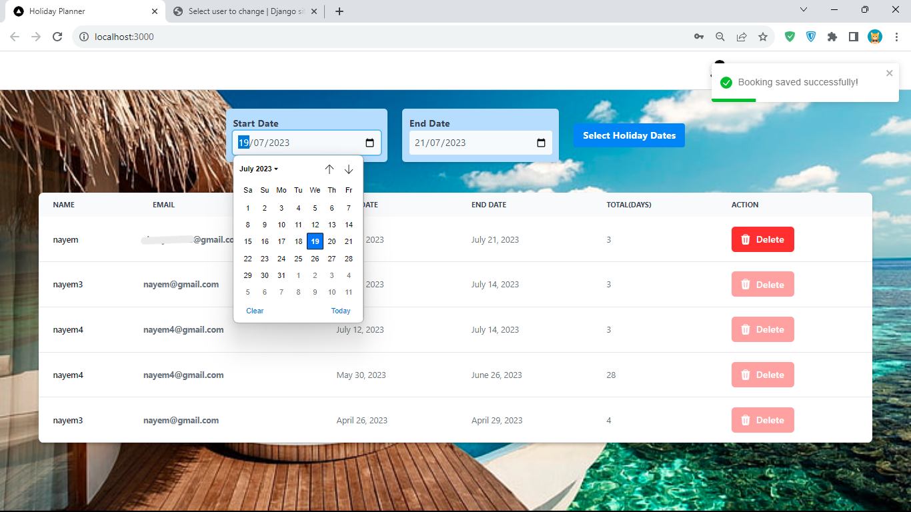
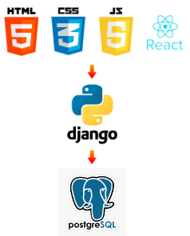
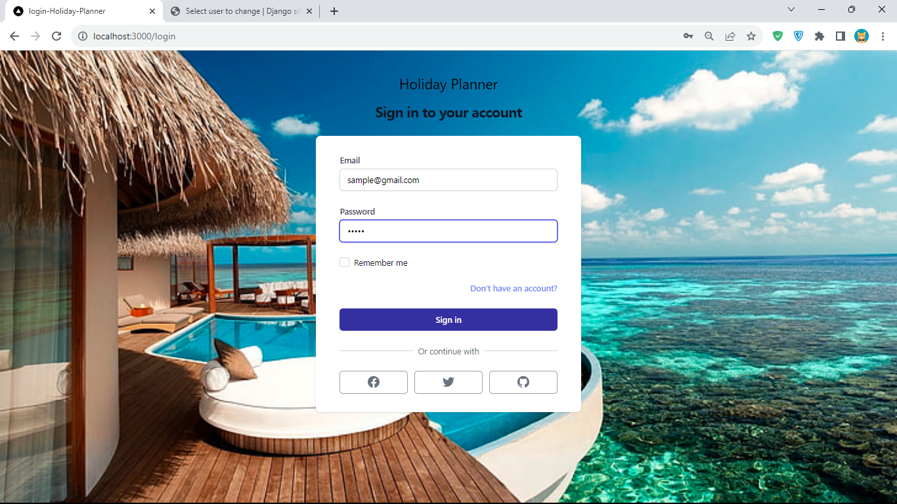

🔰 A scalable and production-ready full-stack web application, combining the power of React, Django, and PostgreSQL. Seamlessly deployed and orchestrated with Kubernetes, while leveraging CI/CD using Jenkins and ArgoCD for streamlined development and reliability.   
🏃‍♂️ Running and Testing the Project in 3 Different Ways:  
**🧑‍🔬 Using Minikube 🙍‍♂️Using Docker-Compose 👶On localhost**

 
#### CI/CD Workflow

## Execute and Evaluate the Web Application
🟢 **Using Minikube**  To run using minikube, make sure you have minikube installed in your mahchine. If your minikube running on docker driver, use these command **Enable-WindowsOptionalFeature -Online -FeatureName Microsoft-Hyper-V -All** and **minikube config set driver hyperv**. The deploy the frontend, backend and database in minikube kubernetes cluster go to ./kubernetes-deployment and run,  
`kubectl apply -f db-service.yaml -f db-deployment.yaml`
 `kubectl apply -f backend-config.yaml backend-service.yaml -f backend-deployment.yaml`
 `kubectl apply -f frontend-config.yaml frontend-service.yaml -f frontend-deployment.yaml`

  
  

🟢 **Using Docker-Compose**  To run using docker-compose, run **"docker-compose up --build"** in the current directory. Please make sure make sure the database credentials of the docker-compsoe file and /backend/start_project/settings.py match. Also in /backend/entrypoint.sh make sure you use the hostname instead of db-service.

🟢 **Running On Localhost**
 To run the frontend and backend application locally, Inside current directory you need to run "npm run build" and "npm start". To run the backend, go to /backend and run "python manage.py migrate" and "python manage.py runserver 0.0.0.0:8000". Please make sure you have postgresql or any other rdbms installed and correctly configured in /backend/start_project/settings.py.

  
  

## Automate Software Delivery

   
Trying to test with different tech stacks, therefore....

